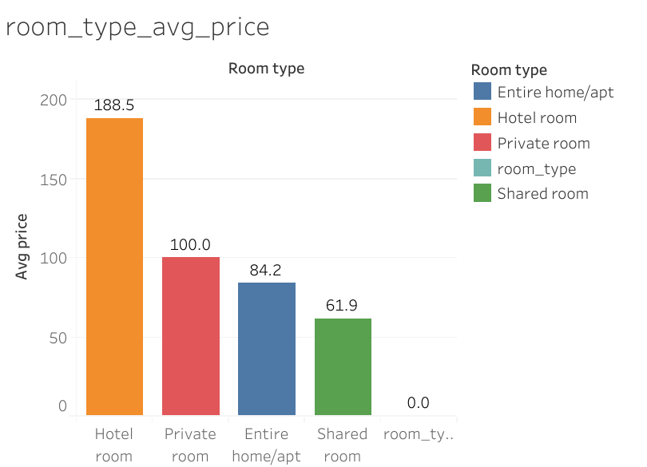
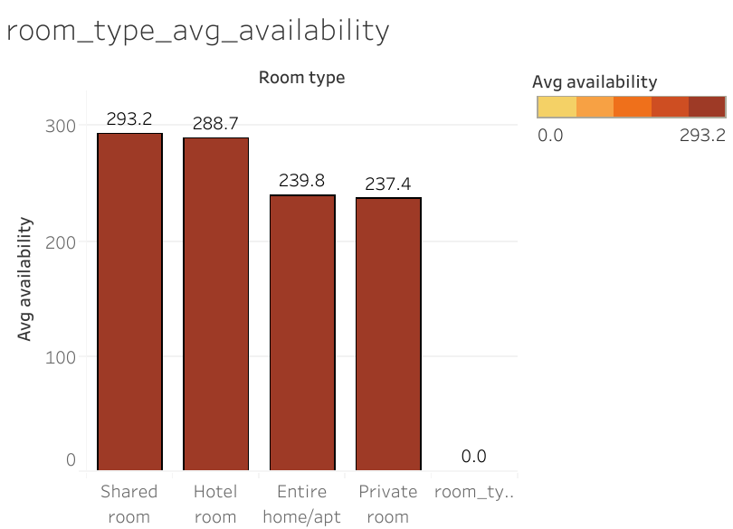
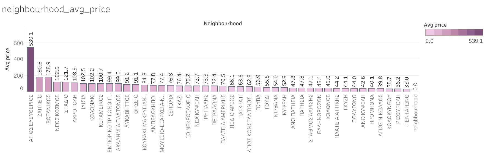
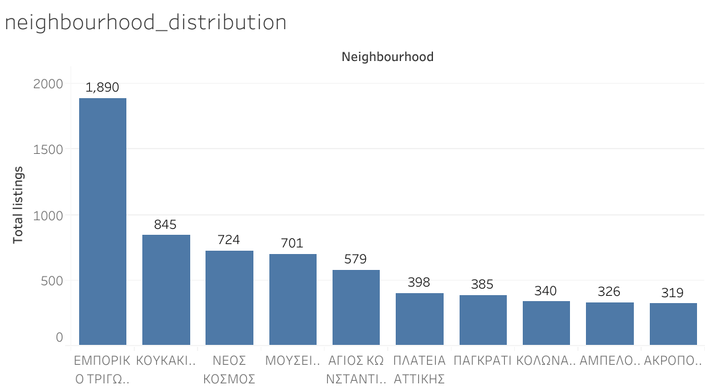

# Athens Airbnb Analysis 🏠

## 📌 Project Overview
This project is an exploratory data analysis (EDA) of **Athens Airbnb listings**.  
The goal is to uncover insights about:
- Popular neighborhoods  
- Pricing patterns  
- Availability of listings  
- Hosts and property types  

## 📊 Dataset
- `listings` table: id, name, neighbourhood, room_type, price, minimum_nights, number_of_reviews, host_id

## 🔍 Tools & Technologies
- **SQL** – for querying and cleaning data
- **Tableau** – for data visualization & interactive dashboards

## 🛠️ Steps of the Project
1. **Data Extraction & Cleaning** – Using SQL to filter, clean, and prepare data
2. **Exploratory Data Analysis (EDA)** – Analyzing patterns in listings, pricing, and neighborhoods
3. **Visualization** – Creating charts & dashboards in Tableau
4. **Insights & Recommendations** – Summarizing findings for stakeholders

## 📈 Sample Insights
- Most listings are concentrated in central neighborhoods  
- Prices vary by property type, with entire apartments being the priciest  
- Hosts with multiple listings dominate popular areas  

## 📂 Project Structure

## 📊 Query Results

- - **Neighbourhood Count** → [data/neighbourhood_counts.csv](data/neighbourhood_counts.csv)
- **Average Price by Neighbourhood** → [data/neighbourhood_avg_price.csv](data/neighbourhood_avg_price.csv)
- **Room Type Price** → [data/room_type_avg_price.csv](data/room_type_avg_price.csv)
- **Room Type Availability** → [data/room_type_avg_availability.csv](data/room_type_avg_availability.csv)

## 📉 Visualizations

### 1. Average Price by Room Type (€)

### 2. Average Availability (365 days) by Room Type

### 3. Average Price by Neighbourhood (Athens)

### 4. Listings Distribution by Neighbourhood

## 🏁 Final Summary

This project analyzed Airbnb listings in Athens to uncover patterns in pricing, availability, and neighborhood trends.  
Using **SQL** for data cleaning and exploration, and **Tableau** for visual storytelling, we identified key insights that can help hosts, travelers, and stakeholders make informed decisions.

### 🔑 Key Insights:
- **Central Athens Dominates**: Most listings are concentrated in central neighborhoods such as *Koukaki*, *Kolonaki*, and *Neos Kosmos*, indicating high demand for these areas.  
- **Entire Homes Are Premium**: Entire apartments have the highest average prices, while shared rooms are the most affordable.  
- **Availability Varies by Room Type**: Some property types are available year-round, while others are more seasonal.  
- **Top Hosts Stand Out**: A few hosts manage multiple listings, showing signs of professional hosting in popular neighborhoods.

### 🌟 What I Learned:
- Practical experience with **SQL** for cleaning and analyzing real-world data  
- Designing **Tableau dashboards** for clear and actionable storytelling  
- Understanding the **relationship between data, business decisions, and visualization**

### 🚀 Next Steps:
- Implement **predictive modeling** to forecast pricing trends using machine learning  
- Expand analysis to include other major cities in Greece for comparison  
- Create an interactive dashboard with filters for property type and neighborhood

---

### 🙌 Acknowledgments
Special thanks to the open-source Airbnb dataset community and the Tableau Public platform for making data visualization accessible and impactful.

---

**Author:** Shirajum Munira  
*Data enthusiast exploring SQL, BI, and analytics for real-world business insights.*

